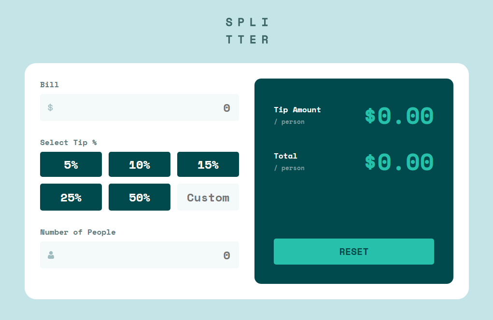

# Frontend Mentor - Tip calculator app solution

This is a solution to the [Tip calculator app challenge on Frontend Mentor](https://www.frontendmentor.io/challenges/tip-calculator-app-ugJNGbJUX). Frontend Mentor challenges help you improve your coding skills by building realistic projects.

### Screenshot

### Links

- [Solution URL](https://www.frontendmentor.io/solutions/tip-calculator-app-width--vNZi4Uy9N)
- [Live Site](https://zxjklp.github.io/tip-calculator-app-main/)

### Built With

- Semantic HTML5 markup
- CSS custom properties
- Flexbox
- CSS Grid
- JavaScript

## Author

- Frontend Mentor - [@Zxjklp](https://www.frontendmentor.io/profile/Zxjklp)
- GitHub - [@Zxjklp](https://github.com/Zxjklp)
